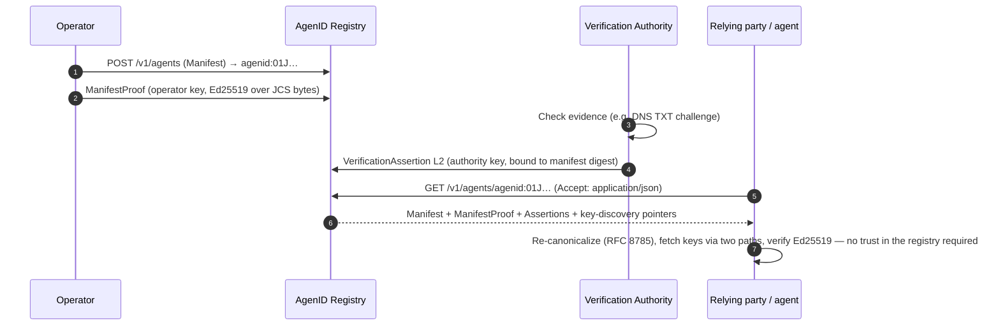

# AgenID Protocol


-6f42c1)

**The open identity, provenance, and machine-resolution standard for AI agents.**

AgenID gives an AI agent a persistent, portable, independently verifiable identity: a permanent `agenid:<ULID>`, an accountable operator, declared attributes, and cryptographically verifiable records that a person, a program, an auditor, or another agent can check **without trusting AgenID's own database**.

This repository is the standard. The reference implementation is [`AgenID-protocol/agenid`](https://github.com/AgenID-protocol/agenid) (`@agenid/core`, TypeScript).

## Contents

| Path | What |
|---|---|
| [`spec/agenid-v1.1.1.md`](spec/agenid-v1.1.1.md) | **AgenID v1.1.1 Final Protocol Specification** — normative |
| [`schemas/`](schemas/) | JSON Schema (draft 2020-12) for every normative object — `manifest`, `manifest-proof`, `assertion`, `keys`, `authorities`. Canonical `$id`: `https://agenid.org/schemas/v1.1.1/<name>.json` |
| [`vectors/`](vectors/) | Deterministic test vectors (§8): real Ed25519 signatures and RFC 8785 canonical bytes, plus the generator that produced them |
| [`docs/errata.md`](docs/errata.md) | Corrections applied after publication |

## How it works



> [!IMPORTANT]
> **DECLARED vs. VERIFIED vs. AUTHORIZED — never inferred from one another.**
> An operator-signed `ManifestProof` produces **DECLARED** only. **VERIFIED** requires a separate `VerificationAssertion` signed by an independent *authority*-role key, bound to a specific manifest version by digest, for one claim / one level / one scope / one validity window. **AUTHORIZED** has no signed object in v1.1.1 (reserved for v1.2). Platform configuration never implies any of the three.

### The signing construction (there is exactly one)

```
signing_input = RFC 8785 JCS( signed_object minus "signature" )   ← "$schema" IS included
signature     = Ed25519.Sign( private_key, signing_input )         ← pure EdDSA (RFC 8032), no pre-hash
```

The `Manifest` itself is never signed directly. It is bound by `SHA-256(JCS(Manifest))` from both signed objects, so one manifest version can carry many assertions without re-signing.

### Keys

```
agenid:key:<ULID>          a key has its OWN ULID — no URI fragments, ever
role ∈ { operator, authority }   enforced at verification time, not just documented
discovery (both must agree):
  GET https://api.agenid.com/v1/keys/{key-ULID}
  GET https://<controller-domain>/.well-known/agenid/keys.json
```

> [!NOTE]
> **Verification levels issuable in v1.1.1: L1–L4.** `L5_CONTINUOUSLY_MONITORED` is a reserved *name* — it is absent from the schema enum so it cannot be issued, and no continuous-integrity claim is made.

> [!WARNING]
> **No production root authority key exists yet.** Until the key ceremony is complete and the pin is published in this repository, no production `VerificationAssertion` can be trusted end-to-end. The vectors use test keys derived from public seed labels.

## Reproduce the test vectors

```bash
pip install rfc8785 cryptography
python3 vectors/generate_vectors.py > my-vectors.json
diff <(python3 -m json.tool my-vectors.json) <(python3 -m json.tool vectors/v1.1.1-vectors.json)
```

Seeds are `SHA-256(label)`; every signature is deterministic. An implementation in any language that does not reproduce these bytes exactly is non-conformant — that is what the vectors exist to catch. CI re-runs this on every push and validates the vectors against the schemas.

## Governance

Maintained by AI Venture Holdings LLC. The specification, schemas, and vectors are MIT-licensed so any platform can implement the standard without a relationship with AgenID; AgenID's own registry and verification services are separate products built on this standard.

Changes to identity, cryptography, serialization, verification semantics, or schemas require an erratum or a new version — the specification is the source of truth, code follows it. Open an issue to propose one.
